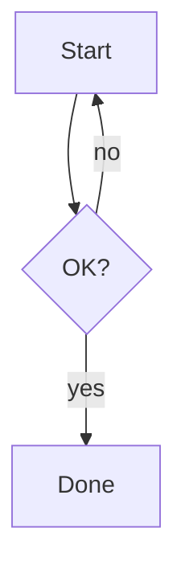

# Authoring notabene docs — the rendering palette

What actually renders in a notabene site, so you can write a **complete** doc with every
tool available and nothing that silently degrades to plain text. Docs are plain files in
the repo (Markdown/MDX), rendered by the notabene renderer (Astro + GFM + Shiki + Mermaid).

## First: know the format

Read `format` in `notabene.config.mjs` (or run `notabene doctor --json`). It decides the pipeline:

- **`commonmark`** (the `init` default) — globs `.md` + `.markdown`, **lenient** CommonMark/GFM,
  **no MDX**. `<`, `{`, `Promise<T>`, raw HTML, GFM tables all render without a crash. Simplest.
- **`mdx`** — globs `.md` + `.mdx`. `.md` stays lenient; **`.mdx` is strict** (JSX/expressions):
  a stray `{` or `<` outside a code fence is a build error.

Everything below works in **both** formats. The MDX-only extras (components/expressions) are
called out at the end.

## The palette (all verified to render)

- **Prose + CommonMark**: headings, lists, `**bold**`, `_italic_`, `> blockquotes`, `---` rules,
  inline `` `code` ``, links.
- **GFM**: tables, task lists (`- [ ] todo` / `- [x] done`), `~~strikethrough~~`, autolinks,
  footnotes (`text[^1]` … `[^1]: note`).
- **Code blocks with syntax highlighting** — fenced with a language, highlighted by **Shiki**
  (theme `github-dark`, soft-wrap on). Any Shiki-supported language:
  ````
  ```ts
  export const x: number = 1;
  ```
  ````
- **Mermaid diagrams** — see the next section (the reason this skill exists).
- **Inter-doc links**: link between docs with **relative `.md`/`.mdx` paths**
  (`[see setup](../guide/setup.md)`) — they're auto-rewritten to site routes. External/absolute/
  anchor links are left as-is.
- **Images**: standard Markdown `` (also good for embedding a pre-rendered SVG — see MCD below).
- **Headings drive the page**: the **first `# H1`** becomes the page title (unless frontmatter
  `title` overrides it — see *Page metadata* below), and headings build the table of contents +
  anchor links. Use **one H1** per page.

## Page metadata: title, sidebar label & order (frontmatter)

Optional YAML frontmatter at the very top of a page controls how it appears in the **sidebar**,
**breadcrumb** and **page `<title>`** — so you don't have to encode ordering as numeric
file-name prefixes:

```yaml
---
title: Cartographie du réseau interne   # page <title> + breadcrumb (overrides the H1)
sidebar:
  label: Cartographie                   # sidebar text (else title, else humanized file name)
  order: 9                              # position among siblings (ascending)
---
```

- **Sidebar label** resolves `sidebar.label` → `title` → humanized file name. Set
  `sidebar.label` to keep a short sidebar entry while the H1 / `title` stays verbose.
- **`order`** sorts siblings ascending. Entries **without** `order` keep sorting
  alphabetically, after the ordered ones — and groups and pages share one ordering, so a
  numbered folder slots into a numbered page sequence without any file-name prefix.
- **A folder** is named and ordered by its **landing page** — `<folder>/index.md` (whose id
  collapses to the folder path) or `<folder>/readme.md`. Put the `sidebar` frontmatter there
  and it applies to the whole group; that page becomes the group's *Overview* entry.
- Frontmatter is **optional**: with none, the sidebar shows humanized file names sorted
  alphabetically (unchanged). Only `title` and `sidebar` are interpreted — any other keys pass
  through untouched.

## Mermaid diagrams (logigrammes, séquences, ER…)

Write a fenced ` ```mermaid ` block — it renders to an SVG **in the browser** (client-side).
Because it's a code fence, it's **MDX-safe**: the diagram's `-->`, `{`, `|`, `<` are never
parsed as JSX, even in strict `.mdx`.

````

````

Supported (Mermaid v11) — the common set: **flowchart** (logigramme), **sequenceDiagram**,
**classDiagram**, **stateDiagram-v2**, **erDiagram** (entity-relationship), **gantt**,
**gitGraph**, **journey**, **pie**, **mindmap**, **timeline**. Diagram source is versioned/diffable
like the rest of the doc.

**Data models — read this before drawing an "MCD":**

- `erDiagram` gives **crow's-foot ER** with attributes + keys (`PK`/`FK`/`UK`) and cardinalities
  (`||--o{`, `}o--||`, …). It maps to a **relational / MLD-level** model — great for most data docs:
  ````
  ```mermaid
  erDiagram
    CLIENT ||--o{ COMMANDE : passe
    COMMANDE {
      int id PK
      int client_id FK
    }
  ```
  ````
- It is **NOT Merise MCD notation** (no associations-in-diamonds, no `0,n`/`1,1` legs, no n-ary
  associations). For a **strict Merise MCD**, draw it with **Mocodo** (open source, dedicated to
  Merise) and embed the exported SVG as an image: ``. Model n-ary relations as an
  associative entity in `erDiagram` if you stay in Mermaid.

**Two caveats:**
- Diagrams render **client-side** (need JS in the browser). In the static build the block ships as
  its source text and becomes an SVG on load. Fine for the review UI and normal hosting.
- A rendered diagram is an **SVG, not prose**. Reviewers **can** comment the *whole* diagram (a
  block comment) and **enlarge** it via the toolbar that appears on hover/tap — the same block
  comment + enlarge works on **images** too — but text-anchoring a comment *inside* the SVG isn't
  possible. Put explanatory prose around a diagram if a reviewer might want to annotate a detail.

## MDX-safety (only when `format: "mdx"`, editing a `.mdx` file)

- Don't leave a bare `{` or `<` **outside** a code fence — MDX reads them as expression/JSX.
  Escape as `\{` / `\<`, wrap in `` `code` ``, or put it in a fence.
- `.md` files are always lenient — no such constraint. When unsure, prefer `.md`.

## Not available (don't write it — it degrades to plain text)

- **Admonitions / callouts** — there's no `:::note` or GitHub `> [!NOTE]` styling. `> [!NOTE]`
  renders as a plain blockquote with the literal text. Use a normal `> blockquote` (or **bold** lead-in).
- **Math** — no KaTeX/MathJax; `$…$` renders literally.
- Custom components in `.md` — only `.mdx` (in `mdx` format) can use JSX/expressions, and only for
  components that resolve in the repo. Keep to the portable palette above unless you know a component exists.

## Working with the other skills

- Just installing/configuring or launching the server → **`notabene-setup`**.
- Applying review comments (which is also *writing docs*) → **`notabene`**; use **this** palette for
  the edits (e.g. a comment asking for "a diagram here" → add a ```mermaid block).
